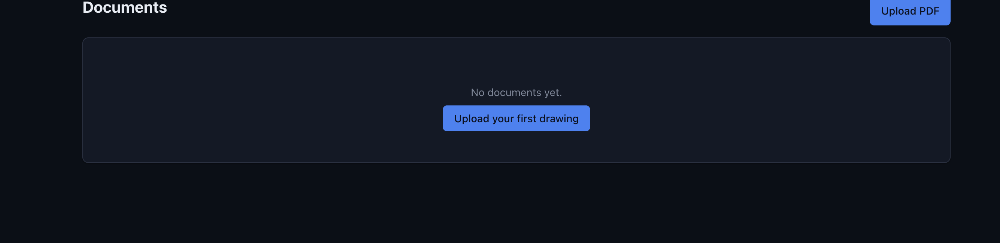
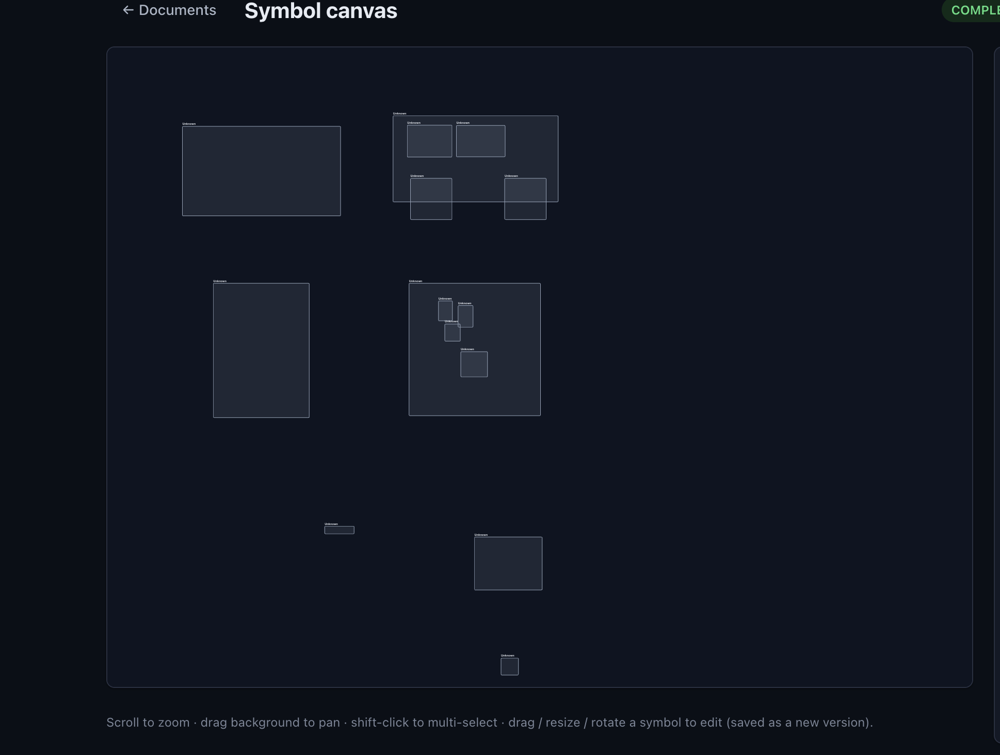
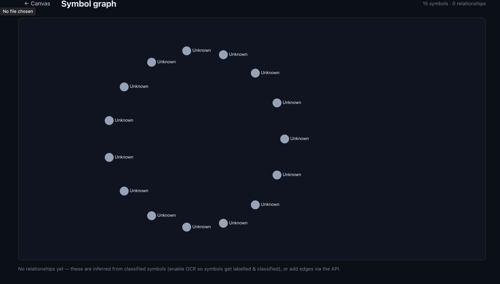
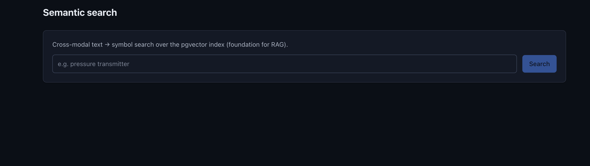
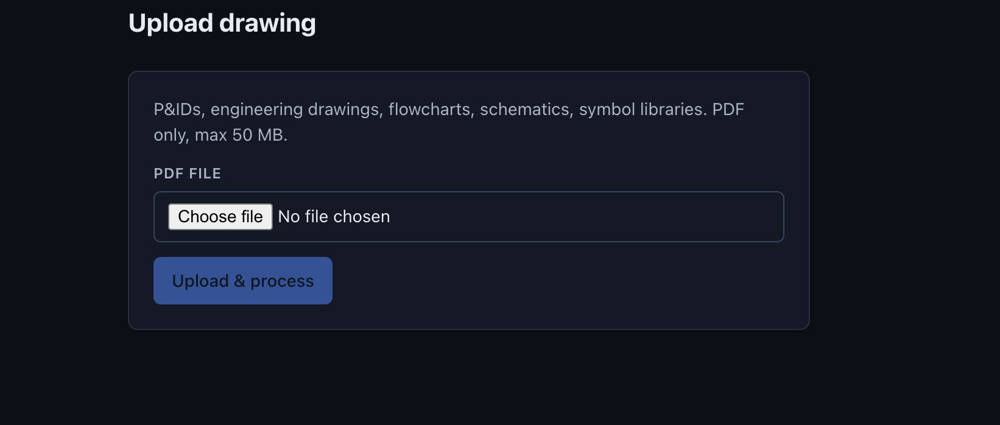
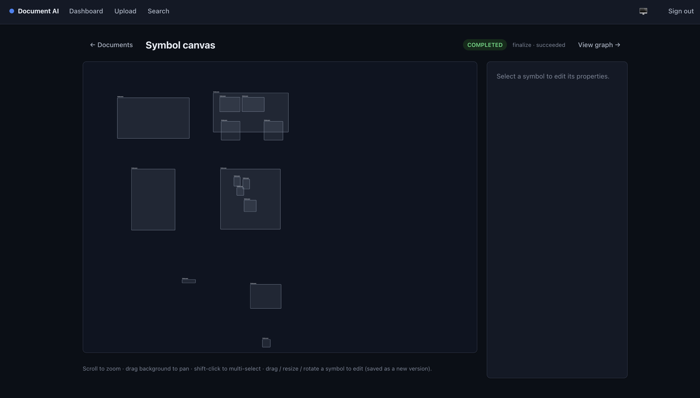

<div align="center">

# 📐 Document AI Platform

**Turn PDFs of engineering diagrams into first-class, editable, searchable objects.**

Upload a P&ID / schematic / flowchart → the platform extracts every symbol, reads its label,
classifies it, embeds it for semantic search, links it into a relationship graph, and lets you
edit it on a canvas — each symbol a structured domain object, never "just an image".

[Architecture](#-architecture) · [How it works](#-how-it-works) · [Run locally](#-run-locally) ·
[Deploy](#-deployment) · [Design docs](#-design-documentation)

`Python 3.12` · `FastAPI` · `SQLAlchemy 2` · `PostgreSQL + pgvector` · `PyMuPDF` · `OpenCV` ·
`OpenCLIP` · `React` · `TypeScript` · `Konva`

</div>

---

## 🌐 Live demo

| Surface | URL |
|---------|-----|
| Frontend (Vercel) | `https://<your-app>.vercel.app` |
| API + OpenAPI docs (Render) | `https://<your-api>.onrender.com/docs` |

> _Replace the placeholders with your deployed URLs._ The backend runs on Render (API + in-process
> worker in a single free service), the database/queue/blob-store on Neon Postgres, and the SPA on
> Vercel. Free-tier services sleep when idle, so the first request may take ~30–60s to wake.

---

## 📸 Screenshots

> Drop your captures into [`docs/screenshots/`](docs/screenshots/) with the filenames below and
> they'll render here. The UI ships light **and** dark themes (system-aware + toggle).

<table>
  <tr>
    <td width="50%" align="center">
      <br/>
      <sub><b>Dashboard</b> — documents with live processing status</sub>
    </td>
    <td width="50%" align="center">
      <br/>
      <sub><b>Canvas</b> — drag / resize / rotate symbols + property editor</sub>
    </td>
  </tr>
  <tr>
    <td width="50%" align="center">
      <br/>
      <sub><b>Graph</b> — inferred symbol relationships</sub>
    </td>
    <td width="50%" align="center">
      <br/>
      <sub><b>Search</b> — cross-modal text → symbol vector search</sub>
    </td>
  </tr>
  <tr>
    <td width="50%" align="center">
      <br/>
      <sub><b>Upload</b> — PDF ingest &amp; validation</sub>
    </td>
    <td width="50%" align="center">
      <br/>
      <sub><b>API</b> — auto-generated OpenAPI / Swagger UI</sub>
    </td>
  </tr>
</table>

## ✨ What it does

```
PDF  →  Extracted Symbols  →  Structured Objects  →  Editable Properties  →  Searchable Knowledge Base
```

A symbol is modelled as a real domain entity, not a picture:

```json
{
  "id": "uuid",
  "type": "Valve",
  "label": "XV-200",
  "page": 1,
  "bbox": { "x": 120, "y": 80, "width": 40, "height": 40 },
  "rotation": 0,
  "properties": { "tag": "XV-200", "pressure": "12.5" },
  "embedding": [ /* 512-d vector in pgvector */ ]
}
```

### Capabilities
- **Upload & validate** PDFs (magic-byte + MIME checks, size caps, PDF-bomb page/pixel guards, optional ClamAV).
- **Extract symbols** with a real CV pipeline (grayscale → threshold → denoise → contour → IoU-NMS → bbox + crop).
- **OCR & label association** (PaddleOCR optional) — nearest-neighbour matching of text to symbols.
- **Classify** via a pluggable strategy (rule engine today → ML/ViT later, same interface).
- **Embed** every symbol (OpenCLIP, or a dependency-free hash embedder) into **pgvector** for similarity search.
- **Relationship graph** — directed, typed edges (`pump --feeds--> valve`) with adjacency + recursive-CTE traversal.
- **Visual editing** — drag / resize / rotate / zoom / pan / multi-select on a Konva canvas; every edit is a versioned, audited change.
- **Versioned, audited, RBAC-protected** REST API with OpenAPI docs.
- **AI search ready** — cross-modal text → symbol search; the foundation for future RAG.

---

## 🏛 Architecture

Clean Architecture + Domain-Driven Design. Source dependencies point **inward only**; the domain
is framework-free and 100% unit-testable.

```
                    React + TypeScript SPA (React Query · Zustand · Konva)
                                        │  HTTPS / JSON (versioned REST)
                    ┌───────────────────▼────────────────────┐
                    │           FastAPI API gateway           │  auth · RBAC · validation
                    │   (thin routers → application services) │  rate-limit · OpenAPI · CORS
                    └───────┬─────────────────────────┬───────┘
            enqueue (outbox)│                         │ read / write
                ┌───────────▼───────────┐   ┌─────────▼─────────────────────────────┐
                │  Postgres job queue    │   │  PostgreSQL + pgvector                 │
                │  FOR UPDATE SKIP LOCKED│   │  metadata · vectors · graph · audit ·  │
                └───────────┬───────────┘   │  durable queue · object blobs          │
                consume     │                └────────────────────────────────────────┘
        ┌───────────────────▼───────────────────────────────┐
        │  Worker pipeline (separate process, or in-process) │
        │  validate → pdf → ocr → classify → embed → graph   │
        └────────────────────────────────────────────────────┘
```

**No Redis/Celery** — the async pipeline runs on a durable **Postgres-backed job queue**
(`FOR UPDATE SKIP LOCKED`), preserving independent per-stage retries, exponential backoff,
dead-lettering, idempotency, and crash recovery. See
[ADR 0005](docs/adr/0005-postgres-job-queue-supersedes-celery.md).

### Layering (`backend/app/`)
| Layer | Responsibility | Depends on |
|-------|----------------|-----------|
| `domain/` | entities, value objects, state machine, domain events, **ports** | nothing (stdlib only) |
| `application/` | use-case services, Unit of Work, auth/RBAC | domain |
| `infrastructure/` | adapters: SQLAlchemy repos, Postgres queue, object store, CV/OCR/embed engines, security | domain (implements ports) |
| `interfaces/` | thin FastAPI routers + DTOs, worker runtime | application |
| `core/` | config, DI container, logging, errors, telemetry | — |

Every external capability is a **port** (interface). Swapping OCR, the embedder, the classifier,
the object store, or the graph backend (→ Neo4j) is one adapter, with **zero** domain changes.

---

## ⚙️ How it works

### Document state machine
```
UPLOADED → VALIDATING → QUEUED → PROCESSING → OCR_RUNNING → CLASSIFYING → EMBEDDING → COMPLETED
              └──────────────── FAILED / RETRYING / CANCELLED (with audit + timestamps) ──────────┘
```
Transitions are enforced by the domain (`Document.transition_to`); each one writes a job update
and an audit entry. Stages are idempotent and independently retryable; a poison task lands in the
dead-letter state after bounded retries.

### Storage model
One datastore by default: **Neon Postgres** holds relational metadata, JSONB properties, vectors
(pgvector HNSW), the relationship graph, the job queue, **and object blobs** — so a deployment
needs nothing else. Flip `APP_OBJECT_STORE_BACKEND=s3` to use MinIO/S3/GCS/R2 for object storage at
scale (the adapter is a config swap). Images/crops are **never** stored inline in entity rows.

---

## 🔬 Engineering highlights

The decisions that make this more than a CRUD app:

- **Broker-free durable queue.** The async pipeline runs on a Postgres `pipeline_tasks` table
  claimed with `SELECT … FOR UPDATE SKIP LOCKED`. It keeps everything a broker gives you —
  concurrent disjoint claims, per-stage retries, exponential backoff, dead-lettering, and
  crash recovery via lease reclaim — with **zero extra infrastructure** ([ADR 0005](docs/adr/0005-postgres-job-queue-supersedes-celery.md)).

- **Transactional outbox.** Upload persists the `Document`, the audit row, **and** the first
  queue task in a single transaction — so a committed document always has its task, and a
  rolled-back upload leaves no orphan work. No "committed-but-lost-the-message" window.

- **Framework-free domain.** The `domain/` layer imports only the standard library — no FastAPI,
  SQLAlchemy, or Pydantic. The document state machine, geometry math, and label-association
  algorithm are pure and unit-tested in isolation, which is what makes the 90% coverage gate real.

- **Everything is a port.** OCR, the embedder, the classifier, the object store, and the graph
  store are all interfaces. Swapping PaddleOCR → Tesseract, hash → OpenCLIP, Postgres-graph →
  Neo4j, or Postgres-blobs → S3 is **one adapter, zero domain changes** — and the classifier is
  explicitly designed to evolve rule-engine → ML → ViT behind the same `SymbolClassifier`.

- **Idempotent, independently-retryable stages.** Each stage is keyed by `(document, stage)`;
  re-running `pdf_extract` rebuilds from a clean slate while later stages update in place, so a
  retry never duplicates symbols or edges. A failure in `embed` never re-runs `ocr`.

- **Versioned, audited edits.** Every canvas edit (move/resize/rotate/reclassify/property change)
  snapshots the prior state into an immutable `symbol_versions` row and writes an `audit_logs`
  entry with the actor and correlation id — full, queryable history.

- **Owner-scoped cross-modal search.** A query symbol, free text, or an uploaded crop all map into
  the **same** pgvector space (OpenCLIP towers), and results are scoped to the caller's documents
  via the repository — security and relevance in one query. This is the seam future RAG plugs into.

- **One image, two roles.** The same service runs as a pure API, an API **with the worker
  in-process** (single free deploy), or a dedicated worker — selected by one env flag. Safe to
  scale to N replicas because `SKIP LOCKED` hands out disjoint work.

- **Observability built in.** A correlation id is generated at the edge and threaded through every
  log line **across the async boundary** (API → queue → worker stages), alongside Prometheus
  metrics and RFC-9457 `problem+json` errors with stable machine codes.

- **Tested against the real thing.** Integration and end-to-end tests run on real Postgres +
  pgvector and real PyMuPDF/OpenCV extraction (upload → `COMPLETED`), including the
  retry → dead-letter → `FAILED` path — not mocks.

---

## 🧰 Tech stack

| Area | Choice |
|------|--------|
| API | FastAPI · Pydantic v2 · Uvicorn/Gunicorn |
| Persistence | SQLAlchemy 2.0 (async) · Alembic · PostgreSQL + pgvector |
| Async pipeline | Postgres job queue (`FOR UPDATE SKIP LOCKED`) — no Redis/Celery |
| CV / OCR / Embeddings | PyMuPDF · OpenCV · PaddleOCR* · OpenCLIP* / hash embedder |
| Security | JWT (access+refresh) · Argon2 · RBAC · rate limiting · ClamAV* |
| Object storage | Postgres blobs (default) or S3/MinIO/GCS/R2 |
| Frontend | React 18 · TypeScript · React Query · Zustand · React Konva |
| Observability | structlog (JSON, correlation IDs) · Prometheus `/metrics` · OpenTelemetry |
| Testing / CI | Pytest · 90% coverage gate · ruff · mypy · bandit · pip-audit · trivy |

<sub>* optional heavy dependencies — install the `ml` extra and set the matching backend.</sub>

---

## 📁 Repository structure

```
.
├── backend/
│   ├── app/
│   │   ├── domain/            # entities, value objects, state machine, events, ports
│   │   ├── application/       # use-case services, Unit of Work, security
│   │   ├── infrastructure/    # db, queue, storage, cv, ocr, classification, embeddings, security
│   │   ├── interfaces/        # http (routers, schemas, middleware), worker (runner, stages)
│   │   └── core/              # config, container, logging, errors
│   ├── migrations/            # Alembic
│   ├── tests/                 # unit · integration · api · worker
│   └── Dockerfile
├── frontend/                  # React + TS SPA (Vite)
├── infra/                     # docker-compose + Prometheus/Grafana config
├── docs/                      # design (Phase 1–4), ADRs, operational guides
├── render.yaml                # Render Blueprint (API + worker)
└── .github/workflows/ci.yml   # lint · types · security · tests + coverage · docker build
```

---

## 🚀 Run locally

**Prerequisites:** Python 3.12, Node 20, a Postgres connection string with the `vector` extension
(local container *or* a free Neon database). **No MinIO/Redis needed** — storage and the queue live
in Postgres.

```bash
# 1. Backend
cd backend
python -m venv .venv && . .venv/bin/activate
pip install ".[dev]"                 # add ".[ml]" for PaddleOCR/OpenCLIP
cp .env.example .env                 # set APP_DATABASE_URL / APP_DATABASE_SYNC_URL (Neon or local)
alembic upgrade head                 # create schema (tables, pgvector, queue, blobs)

# Run the API with the worker loop in-process (simplest):
APP_RUN_WORKER_IN_PROCESS=true uvicorn app.main:app --reload --port 8000
#   → API docs at http://localhost:8000/docs

# 2. Frontend (separate terminal)
cd frontend
npm install
npm run dev                          # http://localhost:5173 (proxies /api to :8000)
```

Register → upload a PDF → watch it march to `COMPLETED` on the dashboard, then edit symbols on the
canvas and try semantic search.

> Prefer the full stack in containers? `docker compose -f infra/docker-compose.yml up --build`
> brings up Postgres+pgvector, the API, workers, Prometheus, and Grafana.

### Key configuration (`APP_` prefixed env)
| Var | Default | Purpose |
|-----|---------|---------|
| `APP_DATABASE_URL` / `APP_DATABASE_SYNC_URL` | local PG | async (app) / sync (migrations) URLs |
| `APP_DB_REQUIRE_SSL` | `false` | `true` for Neon/managed Postgres |
| `APP_OBJECT_STORE_BACKEND` | `postgres` | `postgres` (blobs in DB) or `s3` |
| `APP_RUN_WORKER_IN_PROCESS` | `false` | run the pipeline inside the API process (single-service deploys) |
| `APP_OCR_BACKEND` / `APP_EMBEDDING_BACKEND` | `none` / `hash` | `paddle` / `openclip` need the `ml` extra |
| `APP_JWT_SECRET` | dev default | **must** be set in production |
| `APP_CORS_ALLOW_ORIGINS` | `*` | comma-separated allowed origins |

---

## 🧪 Testing

```bash
cd backend
pytest                               # unit + integration + api + worker
pytest --cov=app --cov-fail-under=90 # enforce the coverage gate
```
The suite runs against **real Postgres + pgvector** and exercises **real PyMuPDF/OpenCV
extraction** end-to-end (upload → COMPLETED), plus the retry → dead-letter path. Domain logic is
pure and unit-tested in isolation. CI additionally runs `ruff`, `mypy`, `bandit`, `pip-audit`, a
Docker build, and a `trivy` image scan.

- **Backend:** ~70 tests, ~91% line coverage (90% gate enforced in CI)
- **Frontend:** Vitest store/component tests; `tsc` + `vite build` in CI

---

## ☁️ Deployment

Deployed as a **single-datastore, zero-paid-add-on** stack:

| Component | Host | Notes |
|-----------|------|-------|
| Database + queue + blobs | **Neon** Postgres (pgvector) | the only stateful dependency |
| API **+ in-process worker** | **Render** web service | `APP_RUN_WORKER_IN_PROCESS=true` (no separate paid worker) |
| Frontend | **Vercel** | `VITE_API_BASE_URL` → Render API; SPA rewrite via `vercel.json` |

Step-by-step (Render/Vercel/Neon, plus the dedicated-worker and S3 variants) is in
**[docs/deployment-guide.md](docs/deployment-guide.md)**. A `render.yaml` Blueprint is included for
one-click API + worker provisioning.

---

## 📚 Design documentation

The design was completed **before** any code (Phases 1–4), then implemented in milestones.

| Doc | Contents |
|-----|----------|
| [Phase 1 — Foundations](docs/01-phase1-foundations.md) | requirements, architecture, **risk register**, tech selection, tradeoffs |
| [Phase 2 — Data/API/Domain](docs/02-phase2-data-api-domain.md) | DDD model, **state machine**, event flow, DB schema, API spec |
| [Phase 3 — Infra/Security/Deploy](docs/03-phase3-infra-security-deploy.md) | topology, security pipeline, observability |
| [Phase 4 — Implementation Plan](docs/04-phase4-implementation-plan.md) | milestones + exit criteria |
| [ADRs](docs/adr/) | clean architecture · pgvector single-store · **Postgres queue (supersedes Celery)** · pluggable strategies |
| Guides | [deployment](docs/deployment-guide.md) · [monitoring](docs/monitoring-guide.md) · [security](docs/security-guide.md) |

---

## 🗺 Roadmap

- **Classification:** rule engine → trained ML classifier → Vision Transformer (same `SymbolClassifier` port).
- **Search → RAG:** cross-modal retrieval today; retrieval-augmented Q&A over the symbol graph next.
- **Graph:** Postgres adjacency now → Neo4j adapter behind `RelationshipRepository` when scale demands.
- **Vectors:** pgvector HNSW now → dedicated vector DB (Qdrant/Milvus) behind `SymbolRepository.search_similar`.

---

<div align="center">
<sub>Built as a production-grade reference: Clean Architecture · DDD · SOLID · 12-Factor · event-driven · fully tested.</sub>
</div>
